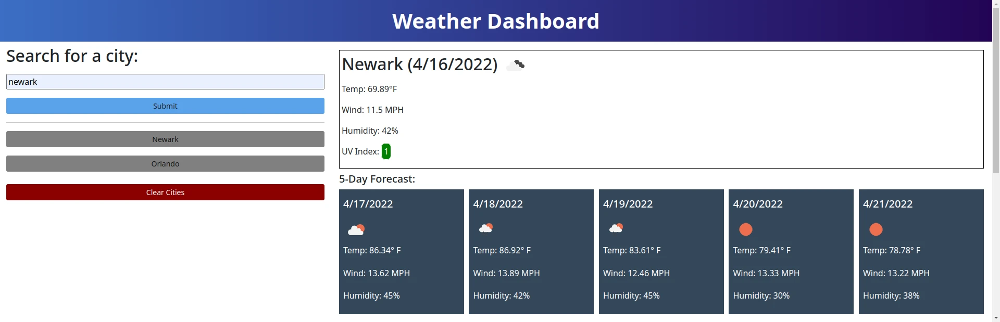

# 06 Weather Dashboard
## What does it do?
Weather dashboard allows you to search for a city and receive a 5-day forecast including temperature, wind speed, humidity, and UV index.

## How does it work?
Simply type the name of your city in the search box and click the SEARCH button.

## What does it look like?

## How do I view it?
[Github](https://github.com/odisclemons/06-weather-dashboard)

[Website](https://odisclemons.github.io/06-weather-dashboard/)